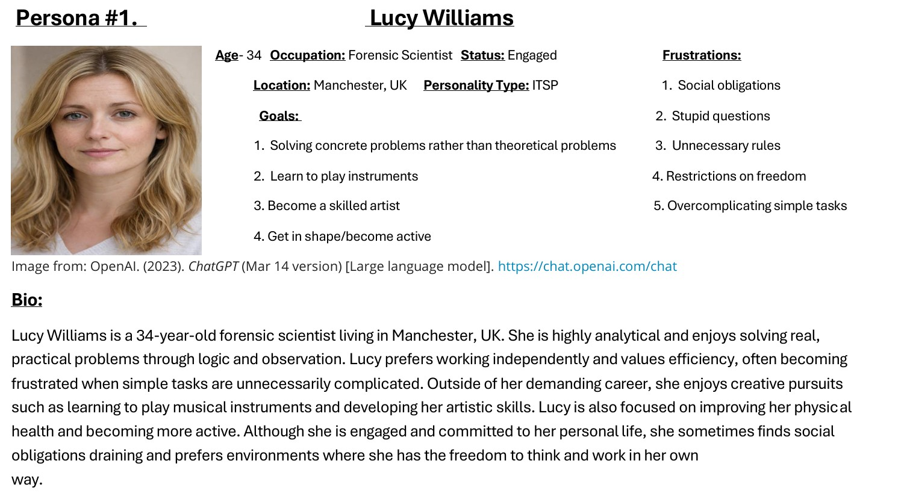
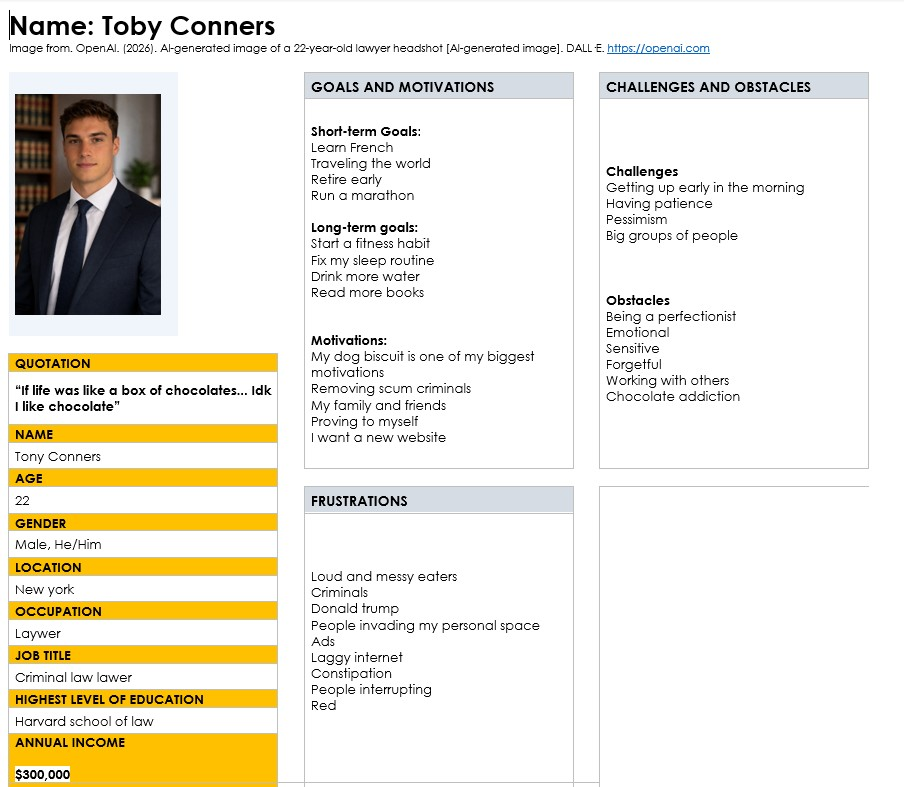
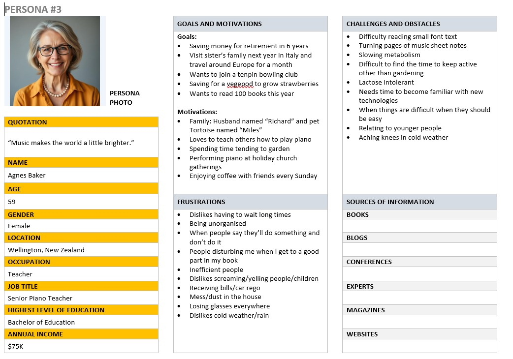

# Iteration 1 

For Iteration 1 we have completed the 
following deliverables:

## Deliverables:
- Stakeholder Register 
- Persona 1 

- Persona 2 

- Persona 3 

- 4 Group Meeting Reports

- Persona r

## Progress reports:

### Aiden
### Agile Projects Progress Report
#### Iteration 1 progress report 
During iteration 1, I created and contributed to the stakeholder register and I also participated in our weekly meetings. I also created and filled out a meeting report providing plans for future meetings and created a persona while also providing feedback on Abby’s persona. Our group worked well together. We assigned each other tasks and completed them all before their deadlines. Our group’s communication was clear and we discussed ideas effectively. However, I found that there was a slight lack of group communication outside of class, which was difficult. To improve and prepare for iteration 2, my group needs to be more efficient in communication within and outside of class. Our group has made really good progress, and we successfully completed the required deliverables for iteration 1. Overall, as a group we worked well together to complete each deliverable. For iteration 2 I’m confident we will work even better and address each struggle we had leaving iteration 1.
### Abby
Iteration 1 – Progress Report – Abby 
Iteration one, completed in 5-week timeframe. I contributed the Stakeholder register, 
Group Meeting Report #2, Group Meeting report #4, Persona #1, and Persona #3 review. 
The stakeholder register consists of three stakeholders, James Smith, Emily Brown and 
Michael Lee. These stakeholders hold the titles of Security Manager, IT Lead and Staff 
Member. They hold the roles of Project Sponsor, Technical Support and User. The 
Group Meeting report #2 consists of the agenda items: Discuss personas and delegate 
personas. This meeting was about the task for iteration one of creating three personas. 
Persona #1 was my persona, Lucy Williams, a 34-year-old Forensic Scientist, and a 
potetional user for our e-commerce website.  Persona #3 Review was a review of the 
persona Agnes Baker, a 59-year-old Senior Piano Teacher, and a potential user of our e
commerce website. Group Meeting Report #4 consists of the agenda items:  check 
documents, and ensure documents are finalized. This meeting was about finalizing and 
editing the documents for Iteration 1. What went well for iteration 1 was the personas 
and persona reviews because we could easily evenly split the tasks, so they were fair. 
We did one persona each and one review each. What we need to work on next time is 
understanding our tasks better and making sure we all do the same amount of work or 
make the tasks balanced for all three iterations. Collectively we have completed all the 
tasks/achievements for iteration 1. Some challenges I had was with Git itself and how 
to git pull and all the other tasks to do with git. 
### Sarah 
